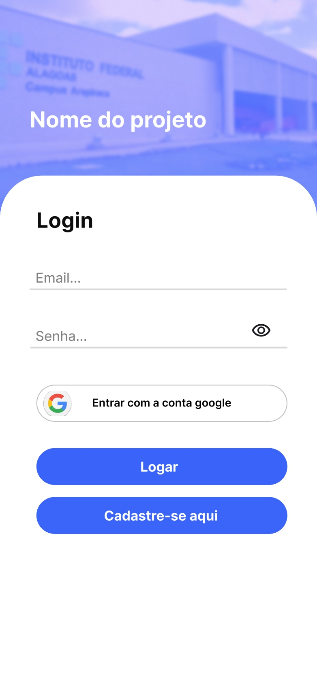
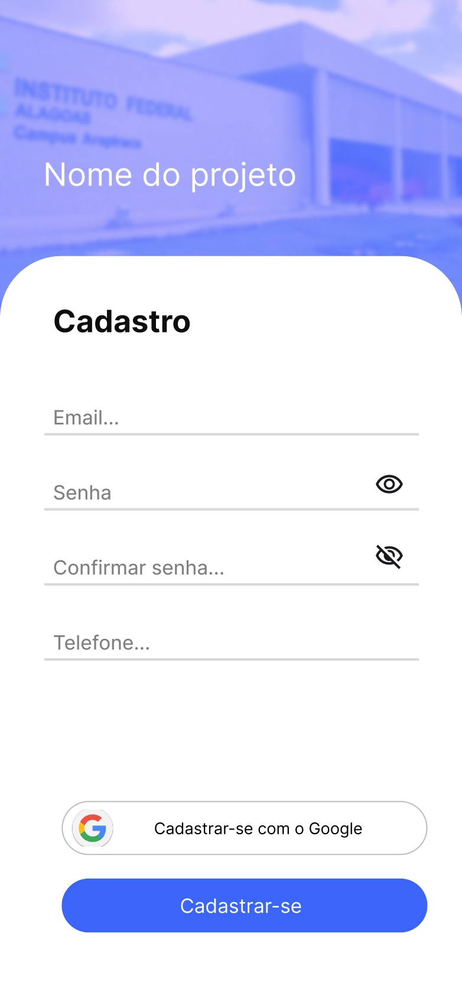
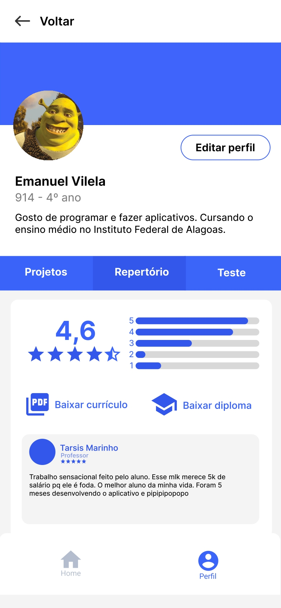
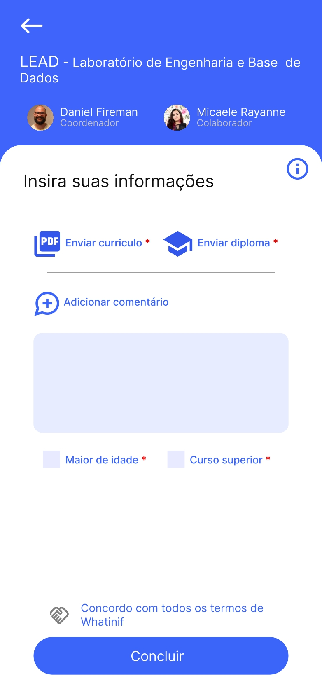

# Aplicativo mobile para Android e IOS

### 
Objetivo: desenvolver uma aplicação que gerencie vagas de projetos do Instituto Federal de Alagoas - Campus Arapiraca

#### Sumário

* <a href="#screens">Telas</a>

## <section id="screens">Telas</section>

### Login:

### Cadastro:

### Tela de perfil do usuário

### Tela de cadastrar pessoa na vaga

